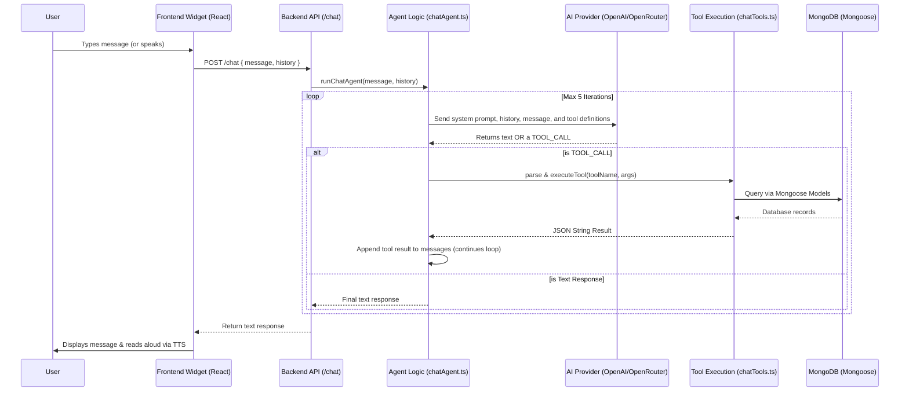

# Aakasmik Nidhi Sanstha - AI Agent Architecture

This document describes how the AI Agent (Chatbot) feature works end-to-end in the Aakasmik Nidhi Sanstha application.

## End-to-End Flow

## Core Components

### 1. The Frontend (`client/src/components/pages/Chatbot.tsx`)
- **Floating Action Button:** Accessible globally across the web app.
- **Voice Support:** Built-in Speech-to-Text and Text-to-Speech that natively supports both English and Hindi inputs/outputs using the browser's Web Speech API.
- **Markdown Rendering:** Beautifully renders lists, bold text, and structured data returned by the LLM.

### 2. Provider-Agnostic LLM Client (`server/src/ai/chatAgent.ts`)
The server uses the official `openai` SDK but leverages **Prompt-based Tool Calling**. 
Rather than relying on OpenAI's native `tools` API (which many free models or alternate proxies do not support), the system explicitly instructs the LLM via the System Prompt to output `TOOL_CALL: tool_name({...})`. 
This guarantees the agent can function using **any** OpenAI-compatible endpoint (OpenRouter, local Ollama, etc.) with **any** model.

### 3. Database Tools (`server/src/ai/chatTools.ts`)
The LLM has access to 11 custom functions that directly query the MongoDB database using Mongoose models. It can fetch:
- Member profiles and counts
- Total fund balances and expenses
- Individual or aggregated contributions (monthly/yearly)
- Pending screenshots for verification

### 4. Environment Configuration (`server/src/config/aiConfig.ts`)
The `aiConfig.ts` module explicitly parses the `.env` file to ensure the application uses the specific URL and model you defined, bypassing potential system-wide environment variable conflicts.

To switch AI providers, edit `server/.env` and uncomment the desired configuration block (OpenAI, OpenRouter).
